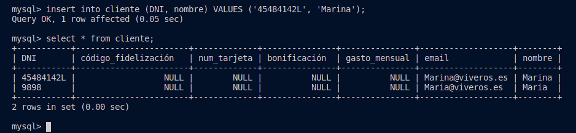
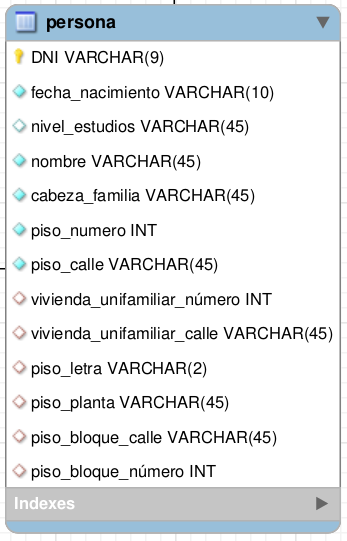
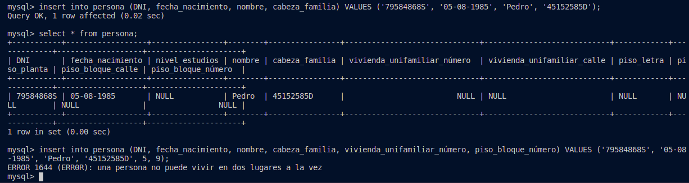
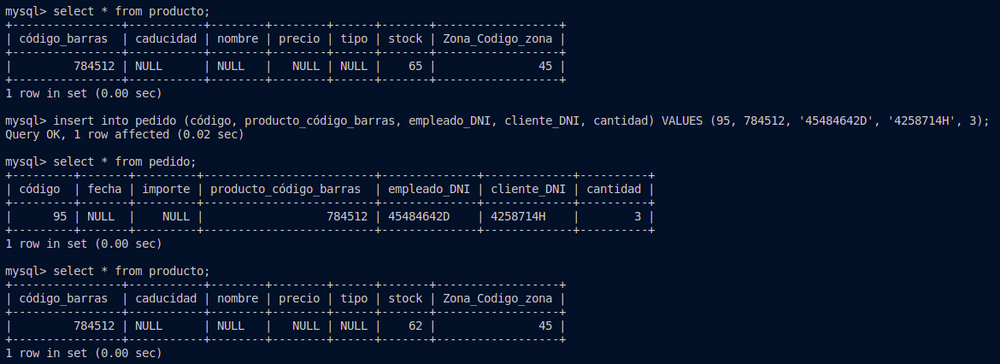

# Práctica: Triggers

- Bárbara Valentina García Deus,
- alu0101108452

## Triggers

### Trigger 1

El siguiente procedimiento devuelva una dirección de correo electrónico con el siguiente formato:
- Un conjunto de caracteres del nombre
- El carácter @.
- El dominio pasado como parámetro.

~~~
CREATE PROCEDURE `crear_email` (IN dominio varchar(25), IN nombre varchar(55), OUT email varchar(60))
BEGIN
	set email :=concat(nombre,'@', dominio);
END
~~~

Luego, creamos el trigger antes del insert de la tabla cliente. Si no se inserta un valor en la columna del email, se llama al procedimiento que hemos descrito anteriormente.

~~~
CREATE DEFINER = CURRENT_USER TRIGGER `mydb_vivero`.`trigger_crear_email_before_insert` BEFORE INSERT ON `cliente` FOR EACH ROW
BEGIN
	IF NEW.email is NULL THEN 
    call crear_email('viveros.es', NEW.nombre, @email_aux);
    SET NEW.email = @email_aux;
	END IF;
END
~~~

En el siguiente ejemplo vemos su funcionamiento:

***

### Trigger 2

Creamos un trigger para verificar que las personas en el Municipio del catastro no pueden vivir en dos viviendas diferentes. 

Nuestra tabla `persona` es la que almacena la vivienda de la persona. 

Es por esto, que lo que tenemos que controlar es que una persona no pueda vivir en un piso y en una vivienda unifamiliar al mismo tiempo. Para controlar esto, comprobamos que no se introducen valores en el campo del número del piso y en el número de la vivienda unifamiliar:

~~~
CREATE DEFINER = CURRENT_USER TRIGGER `mydb_catastro`.`trigger_solounavivienda_before_insert` BEFORE INSERT ON `persona` FOR EACH ROW
BEGIN
	IF ((NEW.vivienda_unifamiliar_número is not NULL) && (NEW.piso_bloque_número is not null) ) THEN 
    SIGNAL SQLSTATE 'ERR0R' SET MESSAGE_TEXT = 'una persona no puede vivir en dos lugares a la vez';
	END IF;
END
~~~

En el siguiente ejemplo vemos su funcionamiento:

***

### Trigger 3

Creamos un trigger que permita mantener actualizado el stock de la base de dato de viveros. 

Lo que hacemos es almacenar el stock del producto del que se acaba de hacer el pedido, y también almacenar la cantidad del producto que se está pidiendo. Y luego, actualizar el stock, restándole la cantidad pedida.

~~~
CREATE DEFINER = CURRENT_USER TRIGGER `mydb_vivero`.`trigger_actualizar_stock_after_insert` AFTER INSERT ON `pedido` FOR EACH ROW
BEGIN
  SELECT stock INTO @stock FROM producto WHERE NEW.producto_código_barras = código_barras;
  SELECT cantidad INTO @cantidad FROM pedido WHERE NEW.producto_código_barras = producto_código_barras;
  UPDATE producto SET stock = @stock - @cantidad WHERE NEW.producto_código_barras = código_barras;
END
~~~

En el siguiente ejemplo vemos su funcionamiento:

## Scripts
 - [catastro](catastro_script.sql)
 - [vivero](vivero_script.sql)

***